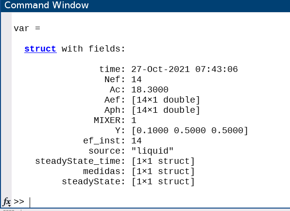

# MATLAB-MongoDB
A more complete integration to import and export data from MATLAB to a Mongo database. Mainly add support for datetimes.

### Limitations of current official implementation
The official Mongodb support ([documentation](https://www.mathworks.com/help/database/ug/import-and-export-matlab-objects-using-mongodb.html)) has an important limitation, MATLAB datetimes objects are not compatible with BSON dates. This means that exported MATLAB datetimes variables to the database will be formatted as string. Date type variables imported from the database will appear as string variables in the MATLAB workspace as well. This second situation can easily be solved with a code similar to:
```MATLAB
timeStamp = datetime(dataFromDatabase.timeStamp, InputFormat = "uuuu-MM-dd'T'HH:mm:ss.SSS'Z'", Timezone="UTC");
```
The first one is not so trivial as it makes impossible to interact with TimeSeries mongoDB collections as well as limiting the time filtered queries on normal collections.

### Proposed alternative
One alternative could be to access every new *document* inserted in the database and update it's `Date` field using MongoDB functions such as [updateOne](https://docs.mongodb.com/manual/reference/method/db.collection.updateOne/#mongodb-method-db.collection.updateOne), [updateMany](https://docs.mongodb.com/manual/reference/method/db.collection.updateMany/#mongodb-method-db.collection.updateMany) and [replaceOne](https://docs.mongodb.com/manual/reference/method/db.collection.replaceOne/#mongodb-method-db.collection.replaceOne). 

A cleaner solution seems to export directly the data from MATLAB. To achieve this, [MATLAB's ability to make use of JAVA libraries](https://www.mathworks.com/help/matlab/matlab-engine-api-for-java.html) is taken advantage of.  
### Use
1. Build a MATLAB object which stores all the necessary data and includes a datetime variable, such as: 
    ```MATLAB
    var = struct(...
        'time', datetime("now", TimeZone="UTC", Format="dd-MMM-uuuu HH:mm:ss"); ,...
        'Nef', 14, ...
        'Ac', 18.3, ...
        'Aef', [24.26; 26.28*ones(13,1)], ...
        'Aph', [5*ones(13, 1); 18.3],...
        'MIXER', true,...
        'Y', [0.1, 0.5, 0.5],...
        'ef_inst',  [14],...
        'source',   "liquid",...
        'Xf', NaN, ...
        'steadyState_time', steadyState_param,...
        'medidas', medidas,....
        'steadyState', steadyState...
    );
    ```
    where `steadyState_time`, `medidas`, `steadyState` are nested structs, for `medidas`:
    ```MATLAB
    var_ids      = ["Ts_in";"Ts_out";"Tf";"Mf"];
    descriptions = [
        "Inlet temperature of the source at the first effect",...
        "Outlet temperature of the source at the first effect",...
        "Feedwater temperature at the first effect",...
        "Feedwater flow at the first effect"];
    sensor_ids   = ["TT-AQU-107a";"HW1TT21";"TE-DES-001";"FT-DES-003"];
    units        = ["ºC";"ºC";"ºC";"kg/s"];

    for i=1:length(var_ids)
        medidas.(var_ids(i)) = struct(...
            'sensor_id', sensor_ids(i), ...
            'var_id', var_ids(i),...
            'description', descriptions(i),...
            'unit', units(i),...
    end
    ```
    Constructing a variable like this results in:

    

2. Export variable to database:
    ```MATLAB
    exportToMongoDB("localhost", 27017, "test_db", "test_col", var)
    ```
3. Import data from database
    ```MATLAB
    data_as_timetable = importFromMongoDB("localhost", 27017, "test_db", "test_col"); 
    ```

### References
1. [MATLAB Answers](https://www.mathworks.com/matlabcentral/answers/713843-can-i-load-java-classes-into-matlab-r2020b-using-maven) Can I load Java classes into MATLAB R2020b using Maven? 
2. [Mongodb java driver. Getting started](https://mongodb.github.io/mongo-java-driver/4.1/driver/getting-started/quick-start/) How to connect to a database using java driver
3. [Connection string](https://docs.mongodb.com/manual/reference/connection-string/) How to connect to a database using java driver. Connection string
